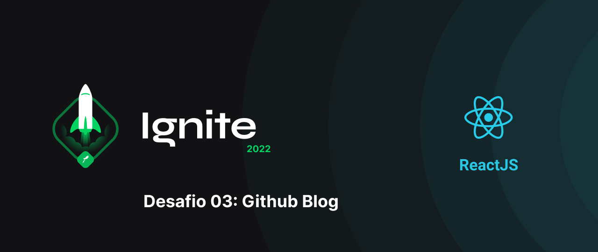

This repository contains the resolution of 3th project: Github Blog from the react js course by rocketseat. The Project fetches issues from a user's github repository and displays them as in the form of a microblog.

